# Jupyter Notebook, Configuration and Styling

## Brief description:

Jupyter notebook is an application that allows users to create and share documentation, code examples (executable), data visualization, and more. With RISE (https://rise.readthedocs.io/) extension these notebooks can be delivered and demonstrated like usual presentations (like Powerpoint or Google Slides).

The main front-end task is implementing corporate styles, investigating possibilities markdown markup language and its parser on the Jupyter Notebook side, and implementing possibilities to create custom layouts in Notebooks cells. Current documentation is the result of all investigations.

## Theme development:
 

RISE actually works as a wrapper of javascript library Reveal.js (https://revealjs.com/) for Jupyter. And reveal.js gives developers the possibility for customization of UI, for example - creating a custom theme (predefined styles for common UI elements and providing own styles for other purposes). As the main reference for designing the theme, I use VTW Sample.pptx , and the development of the theme includes updating and enhancing already provided templates by Reveal.js (https://github.com/hakimel/reveal.js/blob/master/css/theme/README.md) with brand colors/fonts/look and feel of UI elements that can be provided by basic Markdown syntax.

Repository link: https://github.com/artsiom-aliakseichyk/sap-revealjs-theme - Connect to preview 
Prerequirements: nodejs version >= 10.0.0

 

All development related only to this `css/theme/source/sap.scss` file.
After changes to the sap.scss file or/and before committing need to compile scss file to css with the command `npm run build -- css-themes`.

In case of any font adjustments, all font files should be saved in `dist/theme/fonts` directory with creating a folder with the name like font name and a css file with declaring font-face.
As a result, before committing changes we should have modified scss files in the directory (and its subdirectories) `/css/theme/` and compiled theme css file in directory `dist/theme`.
After completing of development and for further integration to Jupyter Notebook changes should be pushed to the remote repository. Usual git-flow will be implemented.

## Local Testing:
 

#### Requirements:

* Installed JupiterHub (not Lab) and Notebook https://github.com/jupyterhub/jupyterhub
* Installed RISE Installation https://rise.readthedocs.io/en/stable/installation.html
* Installing with conda more prefferable as already know where located folder with themes for RISE 

1. Create test notebook with content (if we locally installed only Jupyter Hub with Notebook than new notebook file will be created in a Notebook app). If you want to track your progress notebook should be created in lecture-repo in a separate branch.
2. Find where RISE extension was installed. If RISE was installed with conda path should be similar to this, except user name: `/Users/leverx/opt/anaconda3/share/jupyter/nbextensions/rise/`
3. Go to fe-repo with the latest changes and execute `npm run build -- css-themes`
4. Move compiled `sap.css` file to the folder with path `reveal.js/css/theme/` where RISE located. For example in my case full path will be `/Users/leverx/opt/anaconda3/share/jupyter/nbextensions/rise/reveal.js/css/theme/`
5. Configure Notebook if not configured (see Jupyter Notebook configuration part)

## Theme and custom.js Integration

Theme file and custom.js file will be automatically copied to corresponding folders during server spawning. In case of new changes was added respawn server.

## Jupyter Notebook configuration 

1. This instruction works for old notebooks, just skip steps with creating a new one. Do not forget to move old notebooks to the repository and create separate branches for them. 
New notebooks should have this configuration. There are 2 ways to create new notebook:
With Jupyter Lab - that was described in the previous section: After navigating to a `volume/lecture-repo` directory in a Launcher select Python 3 in the Notebook section.
With Jupyter Notebook -  In File Browser go to the `volume/lecture-repo`. Click on New button in the toolbar and select Python 3 environment.
2. Slideshow mode (to test styles) is available only for JupyterHub so need to switch to the Notebook (if you created a new notebook in Jupyter Lab) by navigating in browser to the https://sap-jptr-poc.eastus.cloudapp.azure.com/user/artsiom-aliakseichyk/tree
Where instead of `artsiom-aliakseichyk` should be your `login/username`. Double click on a newly created notebook. 
3. In File Browser go to the `volume/lecture-repo` where the notebook was created. If a notebook file does not exist or was not created in Jupyter Lab it can be created here by clicking on New button in the toolbar and selecting Python 3 environment. Double click on the notebook file to go to the editor mode.
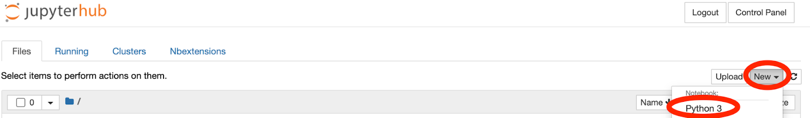
4. In `View` menu select `Cell Toolbar` -> `Slideshow` option.
As a result toolbar with slide type will be added for every Cell in the notebook
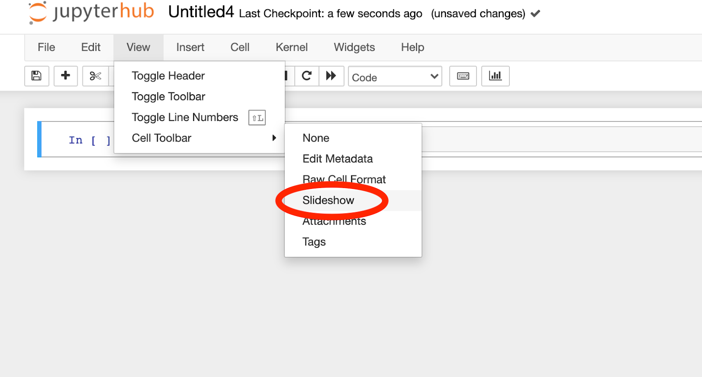
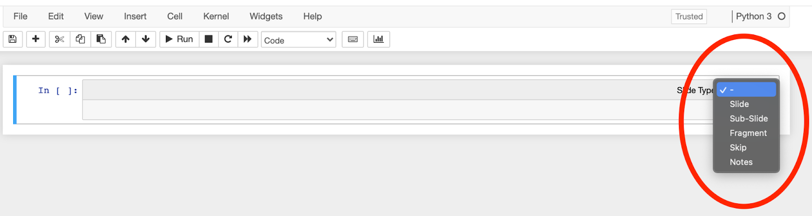
5. Go to `Edit` menu and select `Edit Notebook Metadata.` You will see a popup with metadata in JSON format. 
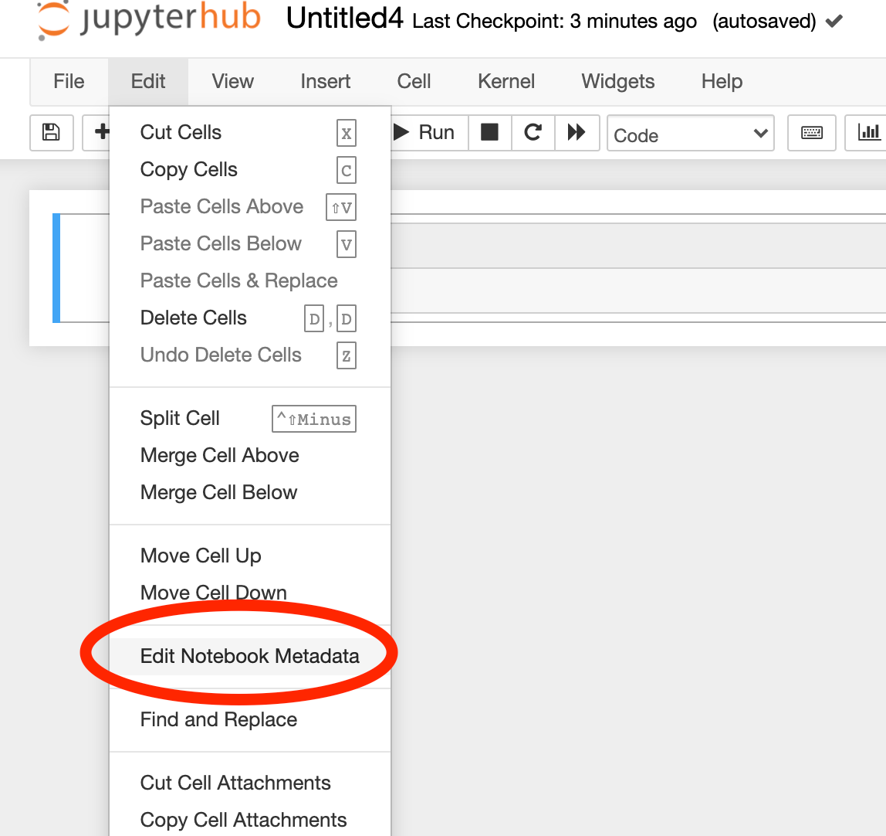
Add next lines to the JSON file:
``
"rise": {
    "footer": "",
    "height": "100%",
    "theme": "sky",
    "width": "100%"
}
``
Metadata should look like on screenshot:
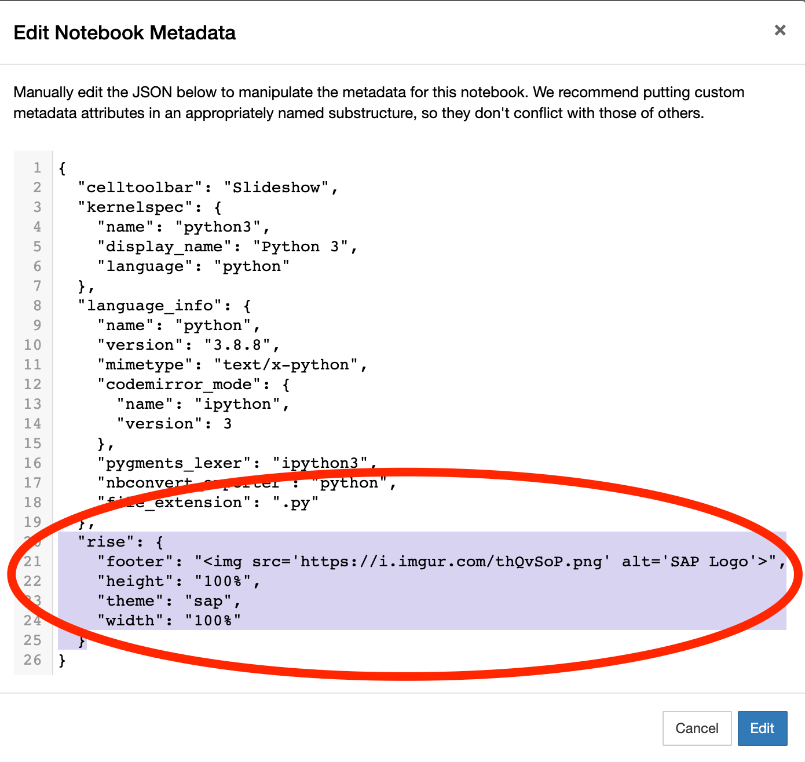
Click Edit Button to apply notebook metadata. Click Save button in the notebook toolbar. 
6. After these changes Notebook is ready for adding content and presenting it with corporate styles.
7. Stage, Commit and Push changes in JupyterLab Git extension if you configure notebook in application or Checkout, Commit and Push when you configure it locally.

 

## Creating New Slide and Run Slide in RISE Slideshow mode

1. A new cell can be added by clicking on Plus button from the Notebook toolbar or by selecting options from Insert menu.
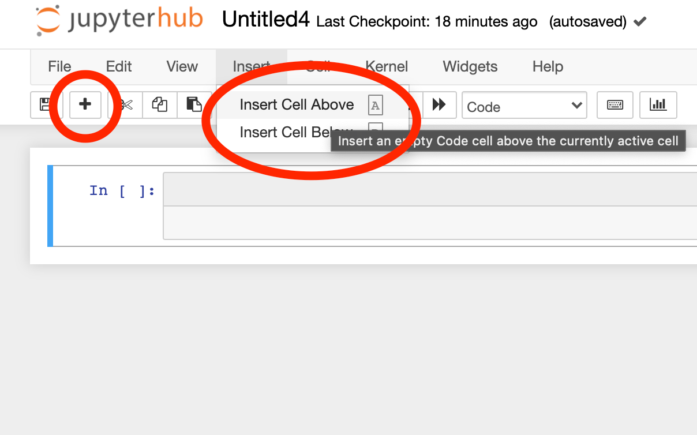
2. RISE provides the possibility to select the cell slide type of every cell by selecting an option from the Cell toolbar. The main difference between slide types:  
    * behavior (skip - the slide will be skipped in Slideshow mode) and/or type of animation (Sub-Slide - bottom to top slide appearing animation and different navigation, Fragment - content that will be rendered in one slide but not at the same time and depends on fragments configuration)
    * content purposes - (Notes - content that is available for presenter in a separate browser window)  
The main type of Cell, for now, will be Slide, Fragment, and Notes not tested, Skip and Subslide works as expected. When the cell type is not selected Cell will be rendered with the content of the first cell above that has cell type.
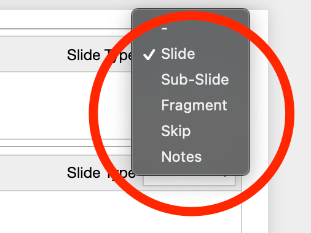

3. Cells have different Types that are responsible for rendering content.  
    * Code means that content in a cell is an executable code written in Python.
    * Markdown - markup language, gives the possibility to style slides in a fast and easy way. See Styling section.
    * Raw NBConvert - cell type to render different code formats into HTML or LaTeX by Sphinx (Python Documentation Generator library)  
    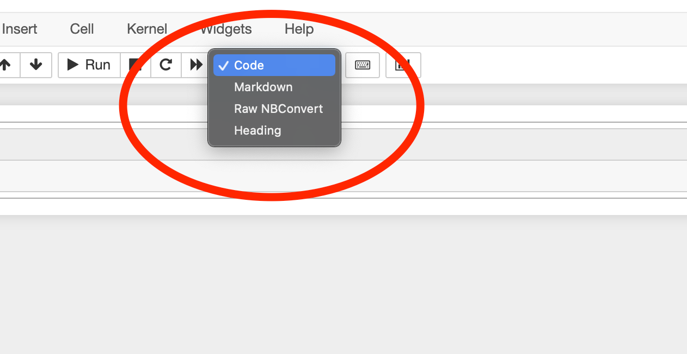
Heading not supported and added heading in markdown (# heading) to the slide. Markdown and Code Cell Types cover all content creator’s needs.
4. After adding content to the cell content should be executed (doesn’t matter is it Markdown or Code Cell Type). This can be done by clicking on Run button (to execute selected Cell) in the Notebook toolbar or selecting the option you need in the Cell menu (Run All Cells)
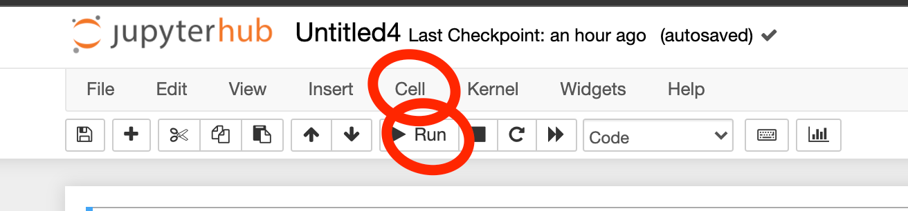
5. For switching to the Slideshow mode Bar Chart Button should be pressed.
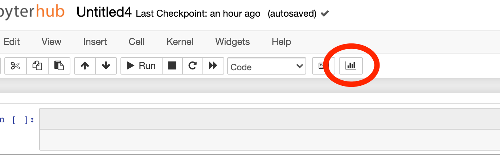
6. RISE provides the possibility to change slide content dynamically. The editor will be available by double-clicking on the content area. To render changed markdown or code need to execute slide by pressing CMD+Enter buttons on Mac.
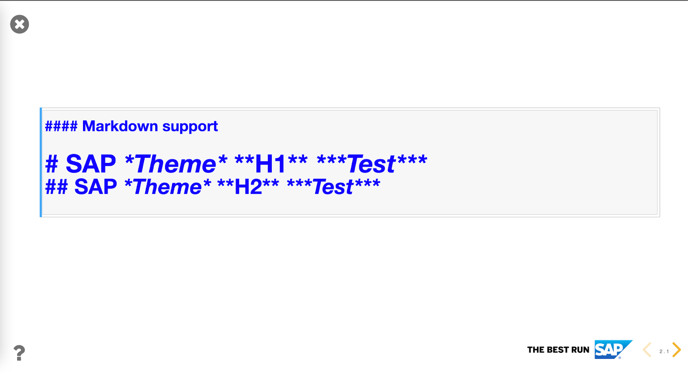
7. After adding content need to save and commit changes. Save can be performed by clicking on the corresponding button on the Notebook toolbar. To commit changes go to the Jupyter Lab by changing the URL replacing the path after your username with ‘lab’:
https://sap-jptr-poc.eastus.cloudapp.azure.com/user/artsiom-aliakseichyk/lab
(Instead of artsiom-aliakseichyk your user name should be in URL).
In the Lab go to the File Browser and go to the directory with your notebook (volume/course-repo). Switch to Git Extension. Check that files to commit are marked as staged and have all changes the content creator added. Commit changes with description message. Push changes by clicking on Push button in the Git extension toolbar.
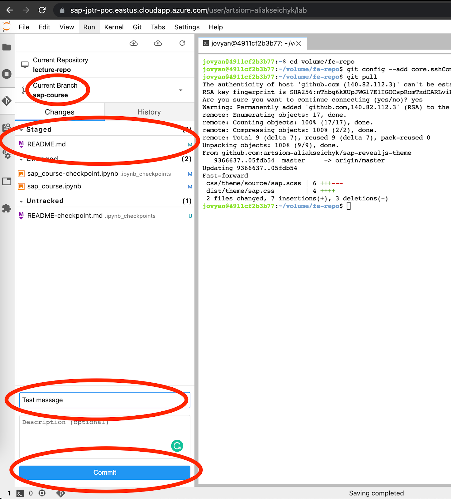
